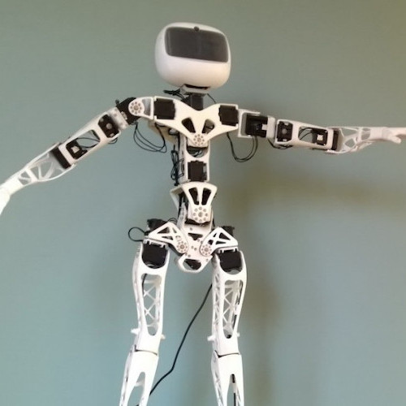
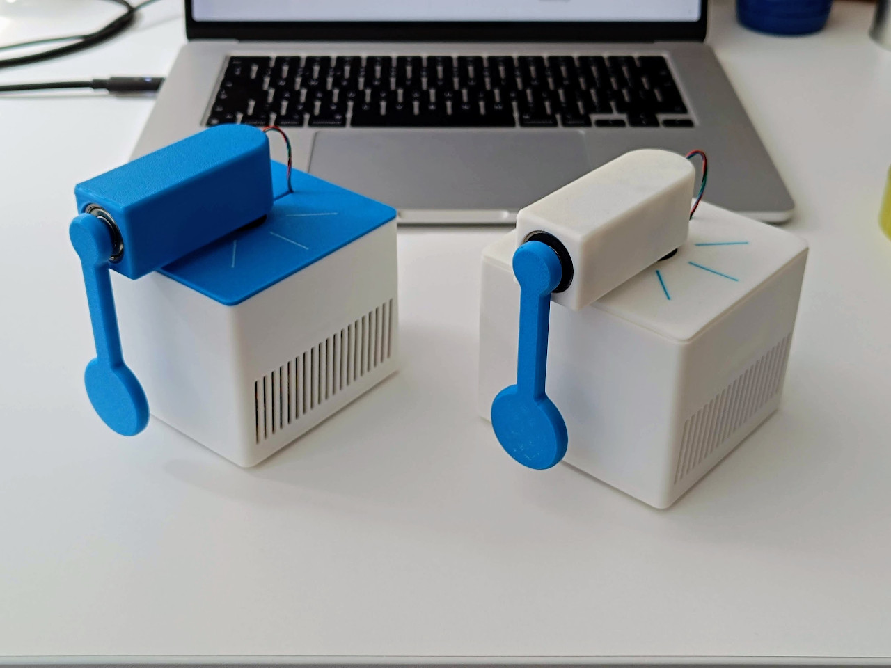
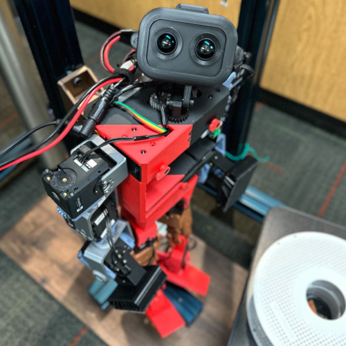

# Awesome Open Source Robots 

A curated list of awesome robots with open source software, open hardware, and in the best cases both.

## Contents

* [Gallery](#gallery)
* [Robots](#robots)
    * [Arms](#arms)
    * [Bipeds](#bipeds)
    * [Educational](#educational)
    * [Humanoids](#humanoids)
    * [Hybrid](#hybrid)
    * [Parallel](#parallel)
    * [Quadrupeds](#quadrupeds)
    * [Wheeled](#wheeled)
* [Adding a Robot to the List](#adding-a-robot-to-the-list)

## Gallery

|  |  |  |  |
|--|--|--|--|
|  |  |  |  |
|  |  |  |  |
|  |  |  |  |

## Robots

### Arms

| Project | Maker | Hardware | HW License | Software | SW License |
|---------|-------|----------|------------|----------|------------|
| [Koch v1.1](https://github.com/jess-moss/koch-v1-1) | Jess Moss | [GitHub](https://github.com/jess-moss/koch-v1-1/tree/main/hardware) | Apache-2.0 | [GitHub](https://github.com/AlexanderKoch-Koch/low_cost_robot/blob/main/robot.py) | MIT |
| [low\_cost\_robot](https://tau-robotics.com/robots) | Alexander Koch | [GitHub](https://github.com/AlexanderKoch-Koch/low_cost_robot/tree/main/hardware) | MIT | [GitHub](https://github.com/AlexanderKoch-Koch/low_cost_robot/tree/main/simulation) | MIT |
| [Thor](http://thor.angel-lm.com/) | Ángel L.M. | [GitHub](https://github.com/AngelLM/Thor) | CC-BY-SA-4.0 | [GitHub](https://github.com/AngelLM/grbl/) | GPL-3.0 |

### Bipeds

| Project | Maker | Foot type | Hardware | HW License | Software | SW License |
|---------|-------|-----------|----------|------------|----------|------------|
| [Bolt](https://www.youtube.com/watch?v=x2jYQdjT_es) | [Open Dynamic Robot Initiative](https://open-dynamic-robot-initiative.github.io/) | Spherical | [Instructions](https://github.com/open-dynamic-robot-initiative/open_robot_actuator_hardware/blob/master/mechanics/biped_6dof_v1/README.md#biped-robot-6dof-v1) | BSD-3-Clause | [GitHub](https://github.com/orgs/open-dynamic-robot-initiative/repositories?for=bolt) | BSD-3-Clause |
| [Duke Humanoid](http://www.generalroboticslab.com/blogs/blog/2024-09-29-dukehumanoidv1/index.html) | Duke University | Linear | [Wiki](https://sleepy-yoke-a21.notion.site/Duke-Humanoid-V1-38d54de887d1403a82f2367490c45b89) | MIT | [GitHub](https://github.com/generalroboticslab/DukeHumanoidv1) | MIT |
| [Kayra](https://youtu.be/ZpM4JqCai9M) | [Ramin Assadollahi](https://github.com/assadollahi) | Flat | [GitHub](https://github.com/assadollahi/kayra/tree/main/STL) | BSD-3-Clause | [GitHub](https://github.com/assadollahi/kayra) | BSD-3-Clause |
| [MABEL](https://hackaday.io/project/174129-mabel-a-boston-dynamics-inspired-balancing-robot) | [Raspibotics](https://github.com/raspibotics) | Wheeled | [GitHub](https://github.com/raspibotics/MABEL/tree/master/CAD) | GPL-3.0 | [GitHub](https://github.com/raspibotics/MABEL/) | GPL-3.0 |
| [Open Duck Mini](https://github.com/apirrone/Open_Duck_Mini) | [Antoine Pirrone](https://github.com/apirrone) | Spherical | [GitHub](https://github.com/apirrone/Open_Duck_Mini/tree/main/mini_bdx/robots/bdx) | Apache-2.0 | [GitHub](https://github.com/apirrone/Open_Duck_Mini/tree/main) | Apache-2.0 |
| [TipTap](https://hackaday.io/project/163093-tiptap) | [Darren V Levine](https://hackaday.io/darrevlevine) | Spherical | [GitHub](https://github.com/DarrenLevine/TipTap/tree/master/parts) | MIT | [GitHub](https://github.com/DarrenLevine/TipTap/tree/master/software) | MIT |
| [Upkie](https://hackaday.io/project/185729-upkie-wheeled-biped-robot) | [Stéphane Caron](https://github.com/stephane-caron) | Wheeled | [Wiki](https://github.com/upkie/upkie/wiki) | Apache-2.0 | [GitHub](https://github.com/upkie/upkie) | Apache-2.0 |

### Educational

| Project | Maker | Hardware | HW License | Software | SW License |
|---------|-------|----------|------------|----------|------------|
| [Rotary Inverted Pendulum](https://github.com/ferrolho/rotary-inverted-pendulum/tree/main) | [Henrique Ferrolho](https://github.com/ferrolho) | [Instructions](https://github.com/ferrolho/rotary-inverted-pendulum/blob/main/README.md), [Meshes](https://github.com/ferrolho/rotary-inverted-pendulum/tree/main/meshes) | MIT | [Arduino](https://github.com/ferrolho/rotary-inverted-pendulum/tree/main/RotaryInvertedPendulum-arduino), [Julia](https://github.com/ferrolho/rotary-inverted-pendulum/tree/main/RotaryInvertedPendulum-julia), [Python](https://github.com/ferrolho/rotary-inverted-pendulum/tree/main/RotaryInvertedPendulum-python) | MIT |

### Humanoids

| Project | Maker | Hardware | HW License | Software | SW License |
|---------|-------|----------|------------|----------|------------|
| [NimbRo-OP2X](https://github.com/NimbRo/nimbro-op2) | NimbRo team | [GitHub](https://github.com/NimbRo/nimbro-op2/tree/master/NimbRo-OP2X/CAD) | ❌ CC-BY-NC-SA-3.0 | [Software](https://github.com/NimbRo/nimbro-op-ros?tab=License-1-ov-file#readme) | BSD-3-Clause |
| [Poppy Ergo Jr](https://github.com/poppy-project/poppy-ergo-jr/) | Poppy project | [Hardware](https://github.com/poppy-project/poppy-ergo-jr/tree/master/hardware) | CC-BY-SA-4.0 | [Software](https://github.com/poppy-project/poppy-ergo-jr/tree/master/software) | GPL-3.0 |
| [Poppy Humanoid](https://www.poppy-project.org/en/robots/poppy-humanoid/) | Poppy project | [Hardware](https://github.com/poppy-project/poppy-humanoid/tree/master/hardware) | CC-BY-SA-4.0 | [GitHub](https://github.com/poppy-project/poppy-humanoid/tree/master/software) | GPL-3.0 |
| [ToddlerBot](https://toddlerbot.github.io/) | ToddlerBot project | Flat | [MakerWorld](https://makerworld.com/fr/models/1068768#profileId-1058247) | ❌ CC-BY-NC-SA-4.0 | [GitHub](https://github.com/hshi74/toddlerbot) | MIT |

### Hybrid

| Project | Maker | Hardware | HW License | Software | SW License |
|---------|-------|----------|------------|----------|------------|
| [Acromonk](https://github.com/dfki-ric-underactuated-lab/acromonk) | DFKI RIC Underactuated Lab | [GitHub](https://github.com/dfki-ric-underactuated-lab/acromonk/tree/main/hardware) | BSD-3-Clause | [GitHub](https://github.com/dfki-ric-underactuated-lab/acromonk/tree/main/software) | BSD-3-Clause |
| [Borinot](http://www.iri.upc.edu/borinot) | HiDRo group | [Hardware](https://github.com/hidro-iri/Borinot/blob/main/hardware/README.md) | BSD-3-Clause | [GitHub](https://github.com/hidro-iri/Borinot/blob/main/software/README.md) | BSD-3-Clause |

### Parallel

| Project | Maker | Hardware | HW License | Software | SW License |
|---------|-------|----------|------------|----------|------------|
| [TriFingerEdu](https://webdav.tuebingen.mpg.de/trifinger/) | Open Dynamic Robot Initiative | [Instructions](https://github.com/open-dynamic-robot-initiative/open_robot_actuator_hardware/blob/master/mechanics/tri_finger_edu_v1/README.md#trifingeredu-v1) | BSD-3-Clause | [GitHub](https://github.com/orgs/open-dynamic-robot-initiative/repositories?for=trifinger_edu) | BSD-3-Clause |

### Quadrupeds

| Project | Hardware | HW License | Software | SW License |
|---------|----------|------------|----------|------------|
| [DIY hobby servos quadruped](https://hackaday.io/project/171456-diy-hobby-servos-quadruped-robot) | [Hackaday.io](https://hackaday.io/project/171456/instructions) | ❌ CC-BY-NC-SA-3.0 | [GitHub](https://github.com/miguelasd688/4-legged-robot-model) | GPL-3.0 |
| [MEVIUS](https://haraduka.github.io/mevius-hardware/) | [Google Drive](https://drive.google.com/drive/folders/18i6CWtUG8fkY0rCcbjN5WiUYItjIX0WM) | MIT | [GitHub](https://github.com/haraduka/mevius) | MIT |
| [mjbots quad](https://hackaday.io/project/167845-mjbots-quad) | [Fusion 360](https://myhub.autodesk360.com/ue2cb4876/g/shares/SH56a43QTfd62c1cd968fcf1b110c6f45fbb) | ❌ | [GitHub](https://github.com/mjbots/quad/) | Apache-2.0 |
| [Solo](https://www.youtube.com/watch?v=VjpmQ9MsLKg) | [Instructions](https://github.com/open-dynamic-robot-initiative/open_robot_actuator_hardware/blob/master/mechanics/quadruped_robot_12dof_v1/README.md#quadruped-robot-12dof-v1) | CC0-1.0 |  [GitHub](https://github.com/orgs/open-dynamic-robot-initiative/repositories?for=solo) | CC0-1.0 |

### Wheeled

| Project | Maker | License | Build | Software |
|---------|-------|---------|-------|----------|
| [Hoverbot](https://www.youtube.com/watch?v=syxE1NEU7lw) | Josh Pieper | Apache-2.0 | [GitHub](https://github.com/mjbots/hoverbot/blob/main/BOM.md) | [GitHub](https://github.com/mjbots/hoverbot/) |
| [JPL Open Source Rover](https://open-source-rover.readthedocs.io/en/latest/) | Jet Propulsion Laboratory | Apache-2.0 | [Build](https://github.com/nasa-jpl/open-source-rover#rover-build-roadmap) | [GitHub](https://github.com/nasa-jpl/osr-rover-code) |
| [OpenScout](https://hackaday.com/2022/09/26/robotic-platform-is-open-sourced-and-user-friendly/) | Samuel Carter | GPL-3.0 | [Manual](https://github.com/cbedio/OpenScout/blob/main/Documentation/CAD_Files/Instruction_Manual/InstructionManual.pdf) | [GitHub](https://github.com/cbedio/OpenScout) |
| [WheelBot](https://sites.google.com/view/wheelbot) | [A. René Geist](https://github.com/AndReGeist) | GPL-3.0 | [GitHub](https://github.com/AndReGeist/wheelbot-v2.5) | [GitHub](https://github.com/AndReGeist/wheelbot-v2.5/tree/main/firmware) |

## Adding a Robot to the List

New robots are welcome to the list, as long as they are [open source](CONTRIBUTING.md) in both hardware and software.
